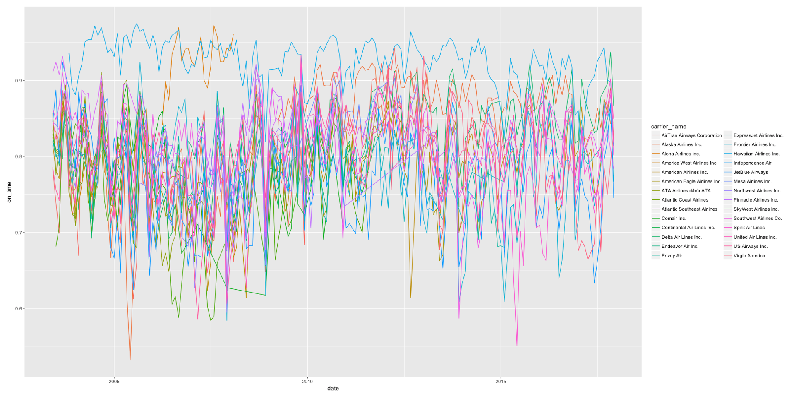
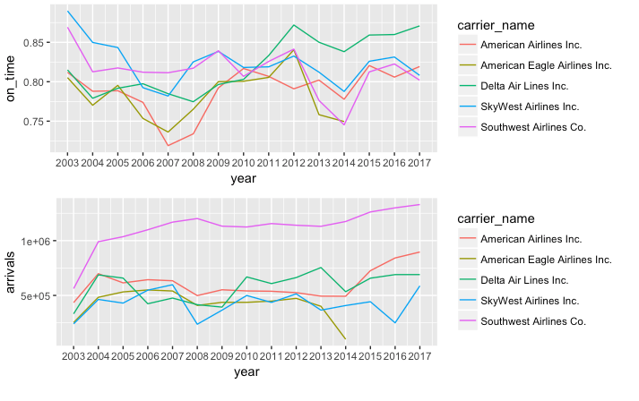
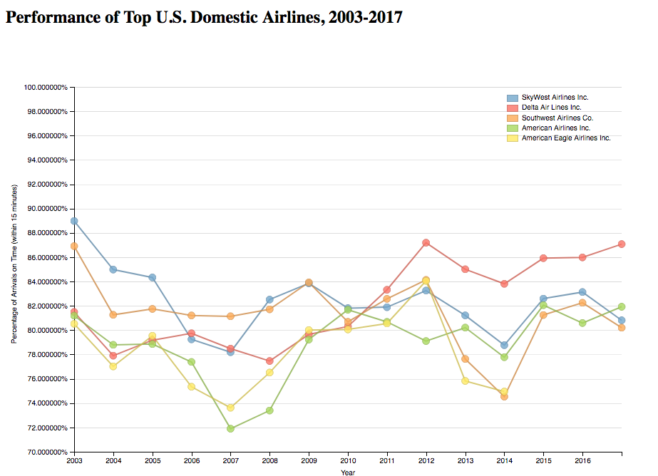
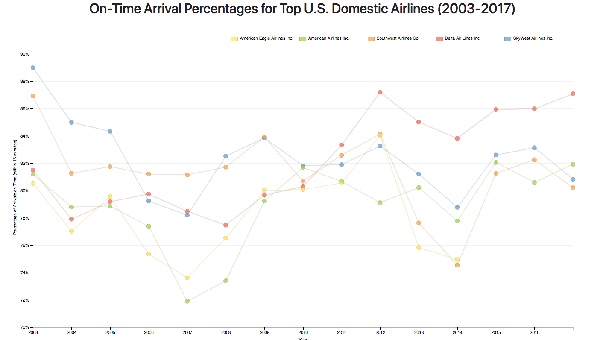

## Make Effective Data Visualization - On-Time Arrival Percentages for Domestic Airlines (2003-2017)
by Matthew Murphy

### Summary

This data visualization charts 5 different U.S. airlines' performance from 2003-2017 by showing the yearly average of on-time arrivals.

### Design

#### Exploratory Data Analysis and Cleaning With R

The dataset for this project came from [RITA](http://www.transtats.bts.gov/OT_Delay/ot_delaycause1.asp?display=download&pn=0&month=12&year=2017).  It includes all domestic flights from all carriers to and from major airports from June 2003 through December 2017.  I conducted exploratory data analysis with **Rstudio**, and is detailed in `./data/exploring_data.Rmd` and `./data/exploring_data.html`.  After reviewing the data, I hypothesized that there might be trends in airline performance (# arrivals delayed / # total arrivals) over the 10+ year period.  A line chart with multiple series is an excellent way to show these trends across different airlines.  I produced a plot to explore the initial data:

This attempt turned into a jumbled mess.  There were 28 airlines, and the line chart was cluttered and impossible to read.  I decided to only look at the top airlines, and only looked at those in the 85th percentile.  This led to me to five airlines, and a much easier to read chart  I generated two plots; a re-do of the first line chart, and another chart showing total annual flights:

Now that I was down to 5 airlines, it was much easier to view the trends.  It shows how various airlines improved or worsened over time, and which ones were currently performing the best, as of 2017.  It also showed the general trends that all of the selected airlines experienced: a dip in performance from 2006 to 2008, individual peaks from 2010 to 2012, another drop from 2012 to 2014, and now an uptick from 2014 through 2017.

I went with performance trends for display as that was the more interesting question.  Who is the most reliable airline that will get me there on-time?

#### Data Visualization With Dimple

The visualization was implemented it with **D3.js** and **dimple.js**.  I thought line charts would work well with this data.  I had an X and Y axis with 5 sets of data points to overlay.  I'm not sure another type of chart would have been readable.  I started with an example and it was all pretty standard.  I put the legend in the top right and decided to start the Y axis at 70% instead of zero.  I felt that if the Y axis went from 0 to 100 it would be too difficult to read.  Otherwise, I did not add much styling.  The first  version can be viewed at `index-initial.html`, or below:

### Feedback

I talked to three different people and asked for feedback on the data visualization.  I gave them a brief description of the information and asked all three the same questions.

* What do you notice in the visualization?
* What questions do you have about the data?
* What relationships do you notice?
* What do you think is the main takeaway from this visualization?
* Is there something you don’t understand in the graphic?

I have listed their feedback below

> I think it looks nice.  I like the colors, they stand out to me.
> There are a lot of extra zeroes in the percentages to the left.  That looks off to me.
> I noticed the airlines all seem to rise and fall together.
> That I want to fly Delta.

> I wish the individual trend lines would stand out a bit more.  At points, they seemed a bit muddled together.
> I see a lot of empty space.  I wonder if the chart could be a little more focused and easier to read
> The airlines are mostly clustered together for the most part.
> Delta may be a bit of an outlier.  The others are clustered together so it's a pretty even race.

> I like the interactive graphic.  I would like more details when hover over a data point.
> I have a hard time not focusing on the present day.  Delta at the top?  I wouldn't have expected that.
> The way airlines rise and fall together makes me wonder what the root cause of that is.  I would like to see that analysis.
> It would be nice if the lines were bigger and easier to follow.

### Post-feedback Design

After considering the feedback and some of my own thoughts, I implemented the following changes:

- I added a `mouseover` event for the lines, so it would 'pop' it out and emphasize the path.  This would allow for better understanding of each individual airline's trend from 2003 to 2017.
- I muted the grid lines to help the lines stand out more.
- I allowed the chart to expand to the width of its container and expanded the height.
- I focused the range more 70% to 90% to help better see the data
- I changed the legend to a horizontal one at the top right.  I find that less distracting.
- Formatted percentages along the Y axis to remove unnecessary zeroes
- I updated the tooltip variable names

You can see the final version at `index.html` or by looking at the image below:

### Resources

- [dimple.js Documentation](http://dimplejs.org/)
- [D3 Documentation](https://github.com/d3/d3/wiki)ri
- [Bootstrap](https://getbootstrap.com/docs/4.0/getting-started/introduction/)
- [Bureau of Transportation Statistics](https://www.transtats.bts.gov/OT_Delay/OT_DelayCause1.asp)
- [StackOverflow](https://stackoverflow.com/questions/10201841/display-y-axis-as-percentages)

### Data

- `data/873572440_122017_237_airline_delay_causes`: original dataset
- `data/data.csv`: cleaned and truncated dataset